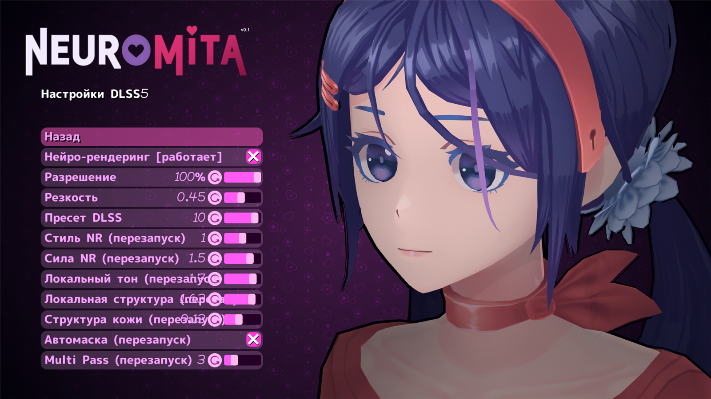
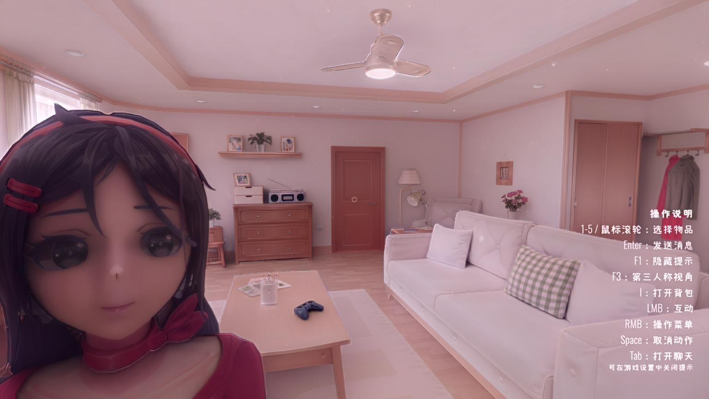

# NeuroMita DLSS5

[中文](README.md) | **Русский**

> 仓库 / Repository: <https://github.com/younai666/NeuroMita.DLSS5>

[](https://github.com/younai666/NeuroMita.DLSS5/releases/latest)
[](https://github.com/younai666/NeuroMita.DLSS5/releases)
[](https://github.com/younai666/NeuroMita.DLSS5/actions/workflows/build.yml)
[](LICENSE)
Добавляет **встроенный DLSS 5 Neural Rendering** в **NeuroMita** (AI-версия MiSide): переключатель и параметры встроены прямо в **штатное меню настроек игры** (`Настройки → Изображение → DLSS5 神经渲染 → DLSS5 设置`), без отдельного оверлея ReShade.

> **Заявление**: этот проект **не является официальным проектом NVIDIA** и никак не связан с NVIDIA, ReShade, RenoDX или сопровождающими DLSS5-Feeder. Проект предоставляет только **интеграцию и интерфейс**; среда выполнения DLSS 5 (`nvngx_dlss.dll` / `nvngx_dlssnr.dll`) и плагин-потребитель распространяются их издателями, и этот проект **не распространяет их повторно**. DLSS и RTX — товарные знаки NVIDIA.

---

## Матрица поддержки

| Пункт | Проверенная версия / требование |
|---|---|
| Игра | NeuroMita `v2026.09.28` (Unity 6000.3.12f1, IL2CPP, metadata v39, 64 бита) |
| Рендеринг | **Встроенный конвейер BiRP**, **вывод через D3D11** (в процессе также создаётся устройство D3D12 для вычислений NGX) |
| Хост плагина | BepInEx **6.0.0-be.788** (IL2CPP / CoreCLR) |
| Хост внедрения | ReShade **6.8.0.2155** (сборка с add-on, локальная загрузка как `dxgi.dll`) |
| Слой подачи кадров | DLSS5-Feeder **1.18.0-beta.1** (`dlss5-feed.addon64`) |
| Нейронный потребитель | RenoDX `renodx-dlss5` **8.5.0-rc10** (+ `nvngx_dlssnr.dll` 310.8.3.0, `nvngx_dlss.dll` 310.9.1.0) |
| Векторы движения | LumeniteFX Kernel (`DLSS5_MV_PROVIDER=3`) |
| GPU | **Нейронная модель работает только на RTX 50** (проект проверен на RTX 5060 Ti / Blackwell2; на RTX 20/30/40 доступен только DLAA, без нейронного рендеринга) |
| Драйвер | Официально требуется **≥ 616.56**; проект проверен на **610.74** (работает через путь подписанного snippet в RenoDX), но обновление всё равно рекомендуется |
| Система | Windows 10 / 11 x64 |

Измеренная производительность (1080p, DLAA + нейронный рендеринг, одна и та же сцена): **включено ≈ 78 fps**, **выключено ≈ 230 fps**; сам нейронный рендеринг стоит около **8–13 мс/кадр** на GPU. Иными словами: **этот DLSS 5 — «качество в обмен на кадры», а не апскейл, повышающий fps** (DLAA работает в нативном разрешении).

---

## Скриншоты

| Файл | Содержимое |
|---|---|
|  | **Страница параметров L2** (на снимке язык игры — украинский: видно, что подписи следуют за языком игры, а длинные подписи уменьшают кегль и не заезжают на ползунок) |
|  | **В игре**: кадр с включённым DLSS 5 нейро-рендерингом |

> Снимки сделаны в игре; чтобы добавить снимок строки входа L1, см. [`docs/screenshots/README.md`](docs/screenshots/README.md).

---

## Возможности

- **Текст меню следует за языком игры**: подписи строк переключаются вместе с языковым параметром игры (поддержаны все 11 языков игры) без перезапуска; длинные подписи автоматически уменьшают кегль и не заезжают на значение и ползунок.
- **Встроенное меню настроек**: строка входа L1 встроена в родную страницу графики игры, по нажатию открывается страница параметров L2; стиль строк, анимация галочки, навигация (мышь/клавиатура/геймпад) полностью используют штатные элементы игры.
- **Мгновенное применение**: параметры стороны Feeder (главный переключатель, рабочее разрешение, резкость, пресет DLSS) записываются в `dlss5-feed.cfg`, Feeder перечитывает файл на ходу — **перезапуск не нужен**.
- **Видимый статус**: подпись строки главного переключателя показывает **реальное** состояние подачи кадров (`[运行中]` / `[已停止]`), определённое по фактической активности в `dlss5-feed.log`, а не по флагу в конфиге.
- **Антидребезг + сторож подачи кадров**: повторные нажатия в течение 800 мс считаются одним; если после включения главного переключателя подача кадров не возобновилась за 8 с, автоматически выполняется цикл `mode 0→2`, а если и это не помогло — `rebuild++` для принудительного пересоздания функции NGX.
- **Самовосстановление**: локализация игры перезаписывает подписи наших строк и даже подменяет шрифт; плагин возвращает их через три хука (`OnEnable` / `RefreshVisuals` / `RefreshLocalizedTexts`) плюс обход каждые 2 с; китайский шрифт синхронизируется со строк-шаблонов после того, как страница становится видимой.
- **Полная обратимость**: все изменения находятся в папке игры, плагин и конфиги удаляются пофайлово, данные самой игры не изменяются.

---

## Как это работает (в двух словах)

```
NeuroMita.exe
├── dxgi.dll = ReShade 6.8 (внедрение в D3D11)
│   ├── lumenite_Kernel.fx   → поставщик векторов движения
│   ├── DLSS5_Feed.fx        → упаковывает кадр + глубину + векторы движения в контракт DLSS
│   ├── dlss5-feed.addon64   → DLSS5-Feeder (захват D3D11 → NGX на приватном устройстве D3D12 → копирование обратно)
│   └── renodx-dlss5.addon64 → нейронный потребитель (читает ReShade.ini [RenoDX.DLSS5])
└── BepInEx 6
    └── NeuroMita.DLSS5.dll  → этот плагин: внедряет страницы L1/L2 в меню настроек игры и подключает переключатель/параметры к двум указанным источникам конфигурации
```

Подробности (включая все найденные грабли и детали уровня смещений) — в [`docs/ARCHITECTURE.md`](docs/ARCHITECTURE.md).

---

## Установка

Требуется: сама игра, BepInEx 6 (IL2CPP), ReShade 6.8 со сборкой add-on, DLSS5-Feeder, потребитель RenoDX DLSS5 и два рантайма NGX. **Эти сторонние компоненты берите из официальных источников.**

1. Установите BepInEx в папку игры (туда, где лежит `NeuroMita.exe`) и запустите игру один раз, чтобы он создал `BepInEx\interop\`.
2. По официальной инструкции DLSS5-Feeder установите ReShade + Feeder + потребителя в папку игры (в нашем окружении использовался официальный скрипт `Install-DLSS5Feeder.ps1` с параметрами `-Api D3D -Consumer RenoDX`).
3. Положите `NeuroMita.DLSS5.dll` в `BepInEx\plugins\`.
4. Запустите игру → `Настройки → Изображение` → найдите `DLSS5 神经渲染`.

> Рекомендуется также отключить собственный стартовый баннер ReShade (он принудительно рисуется во время первоначальной компиляции шейдеров, и никакого параметра конфигурации для него нет). Использованный в проекте способ описан в [`docs/ARCHITECTURE.md`](docs/ARCHITECTURE.md#reshade-启动横幅二进制补丁).

---

## Использование

- **Включение/выключение**: первая строка страницы L2 — `神经渲染总开关`. Выкл = `mode=0` (инертный режим), вкл = `mode=2` (полный путь DLSS).
- **Настройка**: параметры Feeder можно менять в любой момент, они применяются сразу; параметры RenoDX (строки с пометкой `(重启)`) **вступают в силу только после перезапуска игры**.
- **Назад**: строка `返回` на странице L2 находится сразу под заголовком (низ страницы обрезается панелью, и в самом низу до неё не нажать).
- **Внимание**: если в подписи строки показано `[已停止]`, а переключатель включён — значит подача кадров не поднялась. Сторож попытается восстановить её сам, журнал — в `dlss5-feed.log`.

---

## Параметры (кратко)

Полная таблица (отображаемое имя / базовый ключ / тип / диапазон / значение по умолчанию / способ применения) — в **[`docs/CONFIG.md`](docs/CONFIG.md)**.

| Отображаемое имя | Базовый ключ | Расположение | Применение |
|---|---|---|---|
| 神经渲染总开关 | `mode` (2/0) | `dlss5-feed.cfg` | сразу |
| 工作分辨率 | `work_resolution` (50–100%) | `dlss5-feed.cfg` | сразу |
| 锐化 | `work_sharpness` (0–1) | `dlss5-feed.cfg` | сразу |
| DLSS 预设 | `preset` (0–11) | `dlss5-feed.cfg` | сразу |
| NR 风格 / 强度 / 局部色调 / 局部结构 / 皮肤结构 / 自动遮罩 / Multi Pass | `NRLookMode` / `NRIntensity` / `NRLocalTone` / `NRLocalStructure` / `NRSkinStructure` / `NRAutoMask` / `NRPasses` | `ReShade.ini [RenoDX.DLSS5]` | **после перезапуска игры** |

> ⚠️ **Никогда** не записывайте `enabled` в `dlss5-feed.cfg` как `0`. Проверено на практике: прочитав `enabled=0`, Feeder останавливает **и слежение за файлом конфигурации** (после этого `dlss5-feed.log` больше ничего не выводит), и последующая запись `enabled=1` уже не будет прочитана — помогает только перезапуск игры. Главный переключатель обязан работать через `mode`.

---

## Конфигурация

| `BepInEx\config\nm.dlss5menu.cfg` | Настройки самого плагина: `UI.Label`, `Automation.SelfTest` |
| `<папка игры>\dlss5-feed.cfg` | Параметры Feeder (горячая перезагрузка) |
| `<папка игры>\ReShade.ini` | Параметры ReShade и `[RenoDX.DLSS5]` (читаются один раз при загрузке) |

---

## Решение проблем (кратко)

См. [`docs/TROUBLESHOOTING.md`](docs/TROUBLESHOOTING.md). Три самые частые ситуации:

1. **Переключатель нажимается, но ничего не происходит** → сначала проверьте, растут ли размер и время изменения `dlss5-feed.log`; если не растут, Feeder уже «убит» через `enabled=0` (см. предупреждение выше).
2. **Параметры NR меняются, но ничего не меняется** → это нормально, нужен перезапуск игры; выключение и включение главного переключателя **не** заставит потребителя перечитать значения (проверено).
3. **Текст строк поехал или пропали символы** → локализация игры перезаписала подписи и шрифт разошёлся; плагин исправляет это сам, но если проблема остаётся, приложите строки `TEXTPROPS` / `font sync` из `BepInEx\LogOutput.log`.

При сообщении о проблеме прикладывайте: `BepInEx\LogOutput.log`, `dlss5-feed.log`, `ReShade.log` (см. [CONTRIBUTING.md](CONTRIBUTING.md)).

---

## Сборка из исходников

```powershell
# Нужна папка игры (с NeuroMita.exe и BepInEx), так как используются interop-сборки, созданные BepInEx
dotnet build src/NeuroMita.DLSS5/NeuroMita.DLSS5.csproj -c Release `
    -p:GameDir="D:\Games\NeuroMita"
# Результат
# src/NeuroMita.DLSS5/bin/Release/NeuroMita.DLSS5.dll  →  в BepInEx\plugins\
```

`target framework = net6.0`. **CI не может собрать проект полностью**: interop-сборки создаются только локальной копией игры, а в GitHub Actions игры нет → рабочий процесс выполняет лишь проверку структуры репозитория и пробует собрать, а при ожидаемых ошибках вида «нет interop/GameDir» понижает их до предупреждений (см. [`.github/workflows/build.yml`](.github/workflows/build.yml) и [CONTRIBUTING.md](CONTRIBUTING.md)).

---

## Лицензия

MIT, авторство — **NeuroMita DLSS5 contributors**. См. [LICENSE](LICENSE).

## Благодарности и ссылки

- DLSS5-Feeder — <https://github.com/jlrouzies-fr/DLSS5-Feeder>
- DLSS5-Swapper (индекс экосистемы / MIT) — <https://github.com/rakanki911/DLSS5-Swapper>
- Репозиторий RHI (источник релизов `renodx-dlss5`, `nvngx_dlssnr`) — <https://github.com/RankFTW/rhi-repo/releases>
- LumeniteFX (поставщик векторов движения) — <https://github.com/umar-afzaal/LumeniteFX>
- ReShade — <https://reshade.me> · исходники <https://github.com/crosire/reshade>
- BepInEx — <https://github.com/BepInEx/BepInEx> · документация <https://docs.bepinex.dev>
- Magpie (справочник по параметрам DLSSNR; конвейер **захвата экрана**, архитектура проекта **не используется**) — <https://github.com/SAOG0721/Magpie>
- NeuroMita (сама игра) — <https://github.com/VinerX/NeuroMita>
